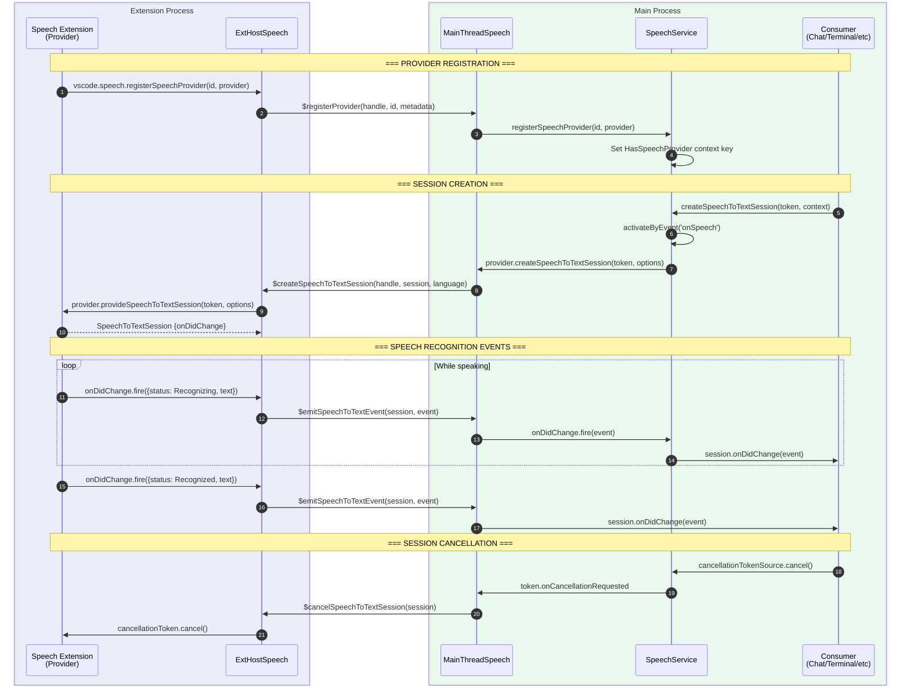
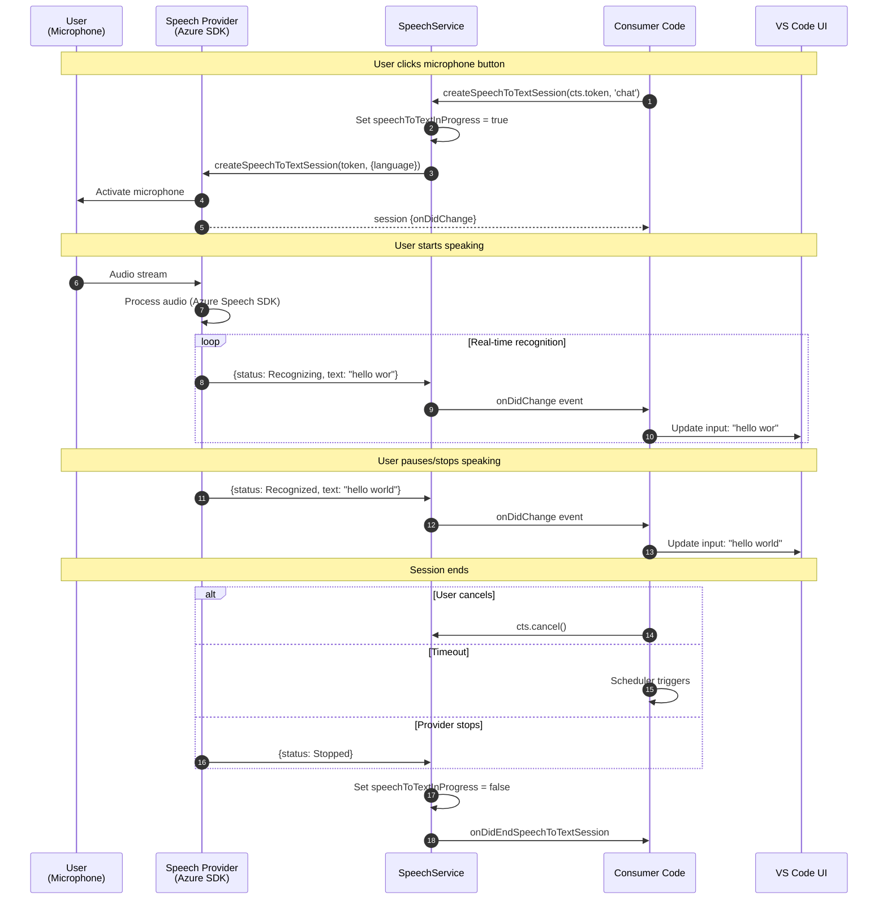
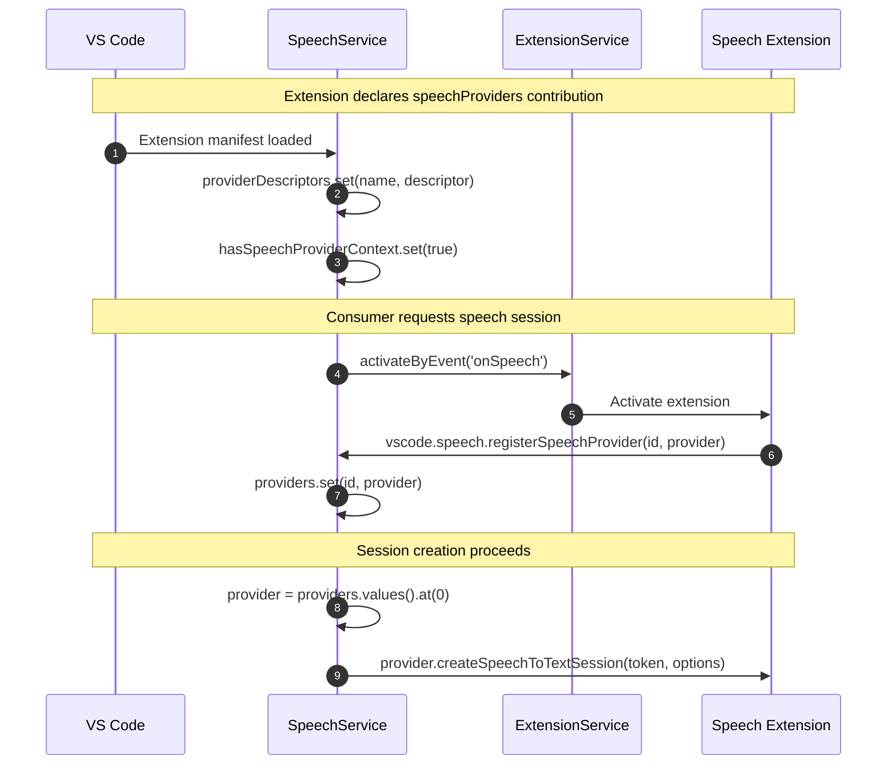

# VS Code Speech API Architecture

This document details the technical architecture of the VS Code Speech API, including component relationships, data flow, and the extension host communication protocol.

## High-Level Architecture



## Component Breakdown

### 1. Extension API Layer (`vscode.proposed.speech.d.ts`)

The proposed API that extensions use to **provide** speech capabilities:

```typescript
// Status enum for speech-to-text events
export enum SpeechToTextStatus {
    Started = 1,      // Microphone activated
    Recognizing = 2,  // Interim recognition (text may change)
    Recognized = 3,   // Final recognition (text is stable)
    Stopped = 4,      // Session ended normally
    Error = 5         // Recognition failed
}

// Event emitted during recognition
export interface SpeechToTextEvent {
    readonly status: SpeechToTextStatus;
    readonly text?: string;  // Recognized text (for Recognizing/Recognized)
}

// Session returned by provider
export interface SpeechToTextSession {
    readonly onDidChange: Event<SpeechToTextEvent>;
}

// Provider interface that extensions implement
export interface SpeechProvider {
    provideSpeechToTextSession(
        token: CancellationToken,
        options?: SpeechToTextOptions
    ): ProviderResult<SpeechToTextSession>;

    provideTextToSpeechSession(
        token: CancellationToken,
        options?: TextToSpeechOptions
    ): ProviderResult<TextToSpeechSession>;

    provideKeywordRecognitionSession(
        token: CancellationToken
    ): ProviderResult<KeywordRecognitionSession>;
}

// Registration API
export namespace speech {
    export function registerSpeechProvider(
        id: string,
        provider: SpeechProvider
    ): Disposable;
}
```

### 2. Internal Service Interface (`ISpeechService`)

The internal service that workbench features use to **consume** speech:

```typescript
export interface ISpeechService {
    readonly _serviceBrand: undefined;

    // Provider availability
    readonly onDidChangeHasSpeechProvider: Event<void>;
    readonly hasSpeechProvider: boolean;
    registerSpeechProvider(identifier: string, provider: ISpeechProvider): IDisposable;

    // Speech-to-Text session management
    readonly onDidStartSpeechToTextSession: Event<void>;
    readonly onDidEndSpeechToTextSession: Event<void>;
    readonly hasActiveSpeechToTextSession: boolean;

    /**
     * Starts to transcribe speech from the default microphone.
     * @param token - Cancellation token to stop the session
     * @param context - Context string for telemetry (e.g., 'chat', 'terminal', 'editor')
     */
    createSpeechToTextSession(
        token: CancellationToken,
        context?: string
    ): Promise<ISpeechToTextSession>;

    // Keyword recognition ("Hey Code")
    readonly onDidStartKeywordRecognition: Event<void>;
    readonly onDidEndKeywordRecognition: Event<void>;
    readonly hasActiveKeywordRecognition: boolean;
    recognizeKeyword(token: CancellationToken): Promise<KeywordRecognitionStatus>;
}
```

### 3. Extension Host Communication Protocol

The IPC protocol between extension host and main thread:

```typescript
// Main thread → Extension host calls
export interface ExtHostSpeechShape {
    $createSpeechToTextSession(handle: number, session: number, language?: string): Promise<void>;
    $cancelSpeechToTextSession(session: number): Promise<void>;
    $createKeywordRecognitionSession(handle: number, session: number): Promise<void>;
    $cancelKeywordRecognitionSession(session: number): Promise<void>;
}

// Extension host → Main thread calls
export interface MainThreadSpeechShape extends IDisposable {
    $registerProvider(handle: number, identifier: string, metadata: ISpeechProviderMetadata): void;
    $unregisterProvider(handle: number): void;
    $emitSpeechToTextEvent(session: number, event: ISpeechToTextEvent): void;
    $emitKeywordRecognitionEvent(session: number, event: IKeywordRecognitionEvent): void;
}
```

## Context Keys

The Speech Service maintains several context keys for UI visibility control:

| Context Key | Type | Description |
|-------------|------|-------------|
| `hasSpeechProvider` | boolean | True when at least one speech provider is registered |
| `speechToTextInProgress` | boolean | True when a speech-to-text session is active |
| `textToSpeechInProgress` | boolean | True when a text-to-speech session is active |

These can be used in `when` clauses for commands and menus:

```json
{
    "command": "myExtension.startVoice",
    "when": "hasSpeechProvider && !speechToTextInProgress"
}
```

## Data Flow Diagram



## Extension Point Registration

Speech providers must declare themselves in `package.json`:

```json
{
    "contributes": {
        "speechProviders": [
            {
                "name": "my-speech-provider",
                "description": "My custom speech recognition provider"
            }
        ]
    },
    "activationEvents": [
        "onSpeech"
    ],
    "enabledApiProposals": [
        "speech"
    ]
}
```

The `speechProviders` extension point is registered in `speechService.ts`:

```typescript
const speechProvidersExtensionPoint = ExtensionsRegistry.registerExtensionPoint<ISpeechProviderDescriptor[]>({
    extensionPoint: 'speechProviders',
    jsonSchema: {
        type: 'array',
        items: {
            type: 'object',
            required: ['name'],
            properties: {
                name: {
                    type: 'string',
                    description: "Unique name for this Speech Provider."
                },
                description: {
                    type: 'string',
                    description: "A description of this Speech Provider, shown in the UI."
                }
            }
        }
    }
});
```

## Provider Activation Flow



## File Reference Map

| Component | File Path | Purpose |
|-----------|-----------|---------|
| Proposed API | `src/vscode-dts/vscode.proposed.speech.d.ts` | Extension-facing TypeScript definitions |
| Service Interface | `src/vs/workbench/contrib/speech/common/speechService.ts` | ISpeechService interface and types |
| Service Implementation | `src/vs/workbench/contrib/speech/browser/speechService.ts` | SpeechService class |
| Extension Host | `src/vs/workbench/api/common/extHostSpeech.ts` | ExtHostSpeech handler |
| Main Thread | `src/vs/workbench/api/browser/mainThreadSpeech.ts` | MainThreadSpeech handler |
| Protocol | `src/vs/workbench/api/common/extHost.protocol.ts` | IPC protocol definitions |
| API Factory | `src/vs/workbench/api/common/extHost.api.impl.ts` | vscode.speech namespace creation |
| Chat Voice | `src/vs/workbench/contrib/chat/common/voiceChatService.ts` | VoiceChatService wrapper |
| Voice Actions | `src/vs/workbench/contrib/chat/electron-browser/actions/voiceChatActions.ts` | Voice chat UI actions |
| Terminal Voice | `src/vs/workbench/contrib/terminalContrib/voice/browser/terminalVoice.ts` | Terminal voice session |
