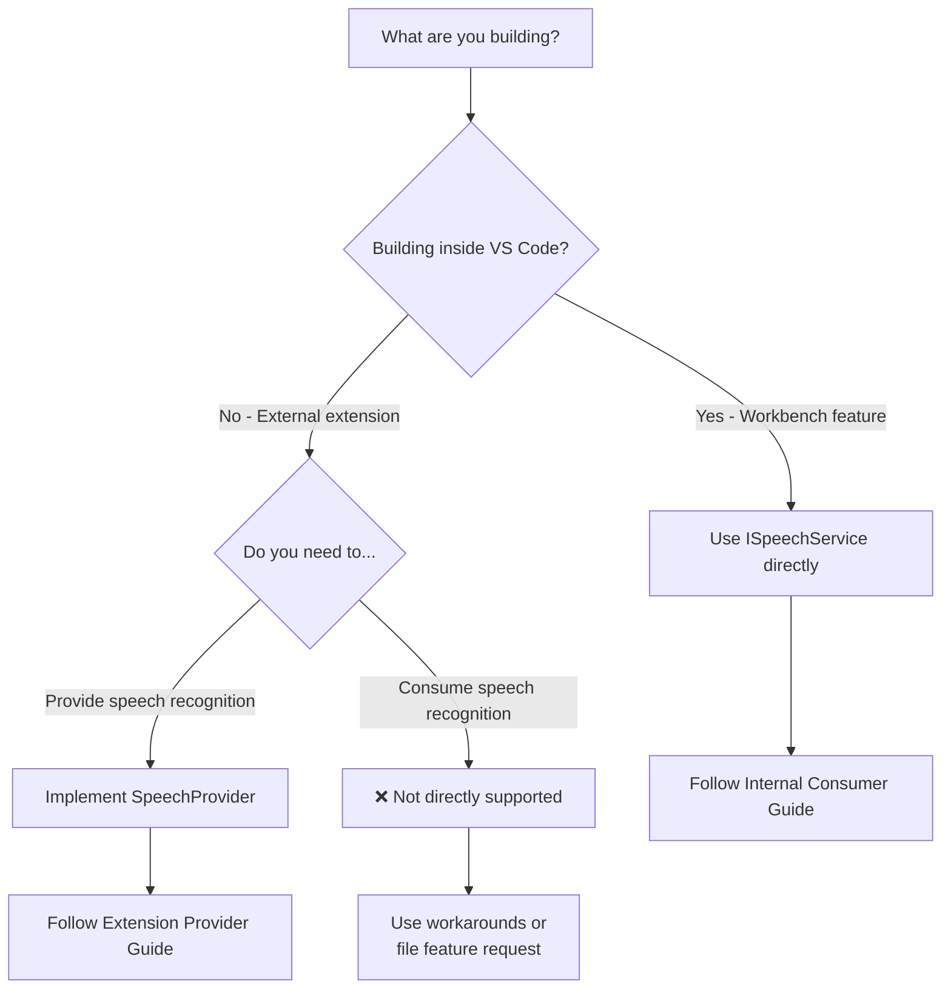

# VS Code Speech API Implementation Plan

This is a step-by-step implementation checklist for adding voice/speech recognition to your VS Code extension or workbench feature.

## Quick Decision Tree



---

## Plan A: Internal Workbench Feature

Use this plan if you're adding voice support to a VS Code workbench contribution (like Terminal, Chat, or Editor).

### Phase 1: Setup

- [ ] Identify the service/contribution where voice will be added
- [ ] Review existing implementations:
  - [ ] [terminalVoice.ts](../src/vs/workbench/contrib/terminalContrib/voice/browser/terminalVoice.ts)
  - [ ] [voiceChatService.ts](../src/vs/workbench/contrib/chat/common/voiceChatService.ts)
  - [ ] [voiceChatActions.ts](../src/vs/workbench/contrib/chat/electron-browser/actions/voiceChatActions.ts)

### Phase 2: Service Integration

- [ ] Add `ISpeechService` to constructor injection:

  ```typescript
  constructor(
      @ISpeechService private readonly speechService: ISpeechService,
      // ... other services
  ) {}
  ```

- [ ] Import required types:

  ```typescript
  import {
      ISpeechService,
      SpeechToTextStatus,
      HasSpeechProvider,
      SpeechToTextInProgress
  } from 'vs/workbench/contrib/speech/common/speechService';
  ```

### Phase 3: Session Management

- [ ] Create session lifecycle management:
  - [ ] `CancellationTokenSource` for session control
  - [ ] `DisposableStore` for event subscriptions
  - [ ] State tracking (recording, stopped, etc.)
- [ ] Implement `start()` method:
  - [ ] Stop existing session first
  - [ ] Create `CancellationTokenSource`
  - [ ] Call `speechService.createSpeechToTextSession(token, context)`
  - [ ] Subscribe to `session.onDidChange`
- [ ] Implement `stop()` method:
  - [ ] Cancel the token source
  - [ ] Dispose subscriptions
  - [ ] Reset state

### Phase 4: Event Handling

- [ ] Handle all `SpeechToTextStatus` cases:
  - [ ] `Started` - Show recording indicator
  - [ ] `Recognizing` - Update preview/ghost text
  - [ ] `Recognized` - Commit final text
  - [ ] `Stopped` - Cleanup
  - [ ] `Error` - Show error, cleanup

### Phase 5: UI Integration

- [ ] Add context key for recording state:

  ```typescript
  const myFeatureVoiceInProgress = new RawContextKey<boolean>(
      'myFeatureVoiceInProgress',
      false
  );
  ```

- [ ] Create actions with appropriate preconditions:
  - [ ] Start Voice action (when: `hasSpeechProvider && !speechToTextInProgress`)
  - [ ] Stop Voice action (when: `myFeatureVoiceInProgress`)
- [ ] Add toolbar/menu contributions with microphone icon

### Phase 6: Configuration

- [ ] Respect `accessibility.voice.speechTimeout` setting
- [ ] Respect `accessibility.voice.speechLanguage` setting
- [ ] Add feature-specific settings if needed

### Phase 7: Polish

- [ ] Add accessibility announcements (`alert()`)
- [ ] Add visual feedback (animations, placeholders)
- [ ] Handle edge cases (no microphone, permission denied)
- [ ] Add telemetry for feature usage

### Phase 8: Testing

- [ ] Unit tests for session management
- [ ] Integration tests with mock `ISpeechService`
- [ ] Manual testing on all platforms

---

## Plan B: Speech Provider Extension

Use this plan if you're creating an extension that **provides** speech recognition capabilities.

### Phase 1: Project Setup

- [ ] Create new VS Code extension project:

  ```bash
  npx yo code
  ```

- [ ] Configure `package.json`:

  ```json
  {
      "enabledApiProposals": ["speech"],
      "contributes": {
          "speechProviders": [{
              "name": "my-speech-provider",
              "description": "My custom speech recognition"
          }]
      },
      "activationEvents": ["onSpeech"]
  }
  ```

- [ ] Download proposed API types:

  ```bash
  npx @vscode/dts dev
  ```

### Phase 2: Speech Engine Integration

- [ ] Choose speech recognition backend:
  - [ ] `@vscode/node-speech` (Azure Speech SDK wrapper)
  - [ ] Web Speech API
  - [ ] Whisper / local models
  - [ ] Other cloud providers
- [ ] Install dependencies
- [ ] Create engine wrapper with consistent interface

### Phase 3: Implement SpeechProvider

- [ ] Implement `provideSpeechToTextSession()`:
  - [ ] Create `EventEmitter<SpeechToTextEvent>`
  - [ ] Initialize speech recognizer with language option
  - [ ] Wire up recognizer events to emitter
  - [ ] Handle cancellation token
  - [ ] Return `{ onDidChange: emitter.event }`
- [ ] Implement `provideTextToSpeechSession()` (optional):
  - [ ] Create synthesizer
  - [ ] Implement `synthesize(text)` method
- [ ] Implement `provideKeywordRecognitionSession()` (optional):
  - [ ] Set up "Hey Code" detection

### Phase 4: Registration

- [ ] Register provider in `activate()`:

  ```typescript
  const disposable = vscode.speech.registerSpeechProvider(
      'my-speech',
      provider
  );
  context.subscriptions.push(disposable);
  ```

### Phase 5: Testing

- [ ] Test in VS Code Insiders:

  ```bash
  code-insiders . --enable-proposed-api=publisher.extension-name
  ```

- [ ] Verify Chat voice input works
- [ ] Verify Terminal voice input works
- [ ] Test language switching
- [ ] Test cancellation handling

### Phase 6: Error Handling

- [ ] Handle microphone permission errors
- [ ] Handle network errors (if cloud-based)
- [ ] Handle audio device changes
- [ ] Emit proper `Error` status with messages

---

## Reference Checklist

### SpeechToTextStatus Event Flow

```
User clicks mic → Started
User speaks    → Recognizing (multiple times, interim text)
User pauses    → Recognized (final text)
User clicks stop / timeout → Stopped
Recognition fails → Error
```

### Required Imports (Internal)

```typescript
// Services
import { ISpeechService } from 'vs/workbench/contrib/speech/common/speechService';
import { IContextKeyService } from 'vs/platform/contextkey/common/contextkey';
import { IConfigurationService } from 'vs/platform/configuration/common/configuration';

// Types
import {
    SpeechToTextStatus,
    ISpeechToTextEvent,
    ISpeechToTextSession,
    HasSpeechProvider,
    SpeechToTextInProgress,
    AccessibilityVoiceSettingId
} from 'vs/workbench/contrib/speech/common/speechService';

// Utilities
import { CancellationTokenSource } from 'vs/base/common/cancellation';
import { DisposableStore, toDisposable } from 'vs/base/common/lifecycle';
import { RunOnceScheduler } from 'vs/base/common/async';
import { RawContextKey } from 'vs/platform/contextkey/common/contextkey';
```

### Required Imports (Extension)

```typescript
import * as vscode from 'vscode';

// Use these types from vscode namespace:
// - vscode.SpeechToTextStatus
// - vscode.SpeechToTextEvent
// - vscode.SpeechToTextSession
// - vscode.SpeechProvider
// - vscode.speech.registerSpeechProvider
```

### Context Keys Reference

| Key | Type | When True |
|-----|------|-----------|
| `hasSpeechProvider` | boolean | A speech provider extension is installed and registered |
| `speechToTextInProgress` | boolean | Any speech-to-text session is active |
| `textToSpeechInProgress` | boolean | Any text-to-speech session is active |

### Settings Reference

| Setting | Type | Default | Description |
|---------|------|---------|-------------|
| `accessibility.voice.speechTimeout` | number | 5000 | Auto-submit timeout in ms (0 = disabled) |
| `accessibility.voice.speechLanguage` | string | "auto" | Recognition language (BCP-47 code) |
| `accessibility.voice.autoSynthesize` | string | "auto" | Auto-read responses ("on", "off", "auto") |
| `accessibility.voice.ignoreCodeBlocks` | boolean | true | Skip code blocks in TTS |

---

## Code Templates

### Minimal Internal Consumer

```typescript
class MinimalVoiceFeature {
    private cts: CancellationTokenSource | undefined;

    constructor(@ISpeechService private speechService: ISpeechService) {}

    async start(): Promise<void> {
        this.stop();
        this.cts = new CancellationTokenSource();

        const session = await this.speechService.createSpeechToTextSession(
            this.cts.token,
            'my-feature'
        );

        session.onDidChange(e => {
            if (e.status === SpeechToTextStatus.Recognized && e.text) {
                console.log('Recognized:', e.text);
            }
        });
    }

    stop(): void {
        this.cts?.cancel();
        this.cts = undefined;
    }
}
```

### Minimal Extension Provider

```typescript
import * as vscode from 'vscode';

export function activate(context: vscode.ExtensionContext) {
    const provider: vscode.SpeechProvider = {
        async provideSpeechToTextSession(token, options) {
            const emitter = new vscode.EventEmitter<vscode.SpeechToTextEvent>();

            // Your recognition logic here
            emitter.fire({ status: vscode.SpeechToTextStatus.Started });

            token.onCancellationRequested(() => {
                emitter.fire({ status: vscode.SpeechToTextStatus.Stopped });
            });

            return { onDidChange: emitter.event };
        },
        async provideTextToSpeechSession() { return undefined; },
        async provideKeywordRecognitionSession() { return undefined; }
    };

    context.subscriptions.push(
        vscode.speech.registerSpeechProvider('minimal', provider)
    );
}
```

---

## Questions to Ask Before Starting

1. **Do I need real-time interim results?** (Recognizing events)
2. **Should I auto-submit after a timeout?**
3. **Do I need to transform the recognized text?** (like Chat's "@workspace" conversion)
4. **What visual feedback should I show during recording?**
5. **How should I handle errors gracefully?**
6. **Do I need to support multiple languages?**
7. **Should my feature work without a speech provider installed?**
